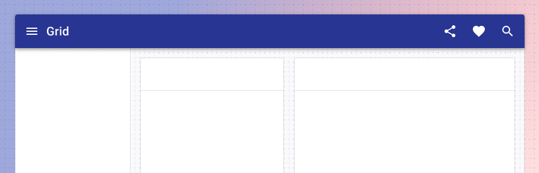

# Overview

<ComponentVisual>

</ComponentVisual>

Patterns guide design choices for common tasks, including picking a date from a calendar, searching for an item and filtering search results to find it, or filling out a form.

The patterns here show recommended components, page layouts, and flows &mdash; along with key interaction states &mdash; using Forge components.

