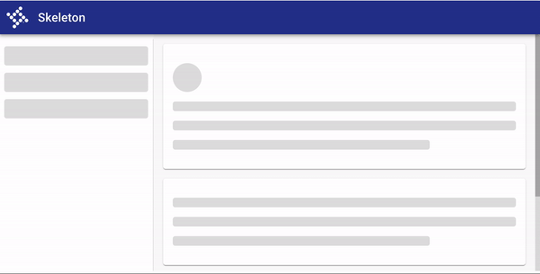
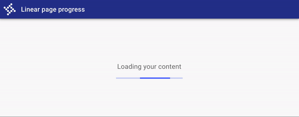
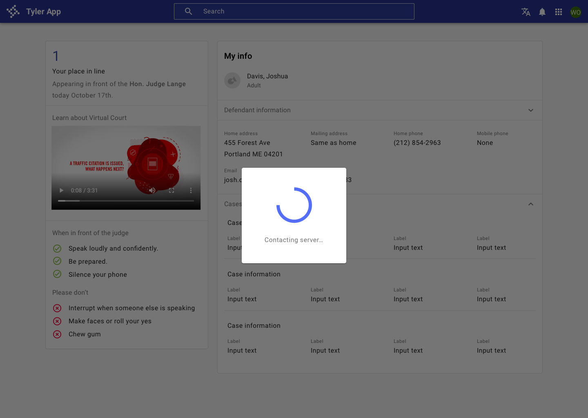

# Progress & Loading

Communicate that content is changing with progress & loading patterns. 

## Overview 

Progress indicators inform users about the status of ongoing processes, such as loading an app, submitting a form, or saving updates. They communicate an app’s state and indicate available actions, such as whether users can navigate away from the current screen. Use a progress indicator for operations that take more than 1 second.

Progress indicators are used to:

- Assure the user that the system is working.
- Provide operational transparency.
- Communicate progress made vs progress pending.
- Reduce users perception of time elapsed.

### Perceptions of waiting

Uncertain waits are perceived as longer than finite waits. Even if we can’t always make actual wait times shorter, we can make the wait more enjoyable. User satisfaction directly correlates to **expectations** (how long do I expect this to take? ) and **perception** (how long did I perceive this to take?). We can manage user expectations through indicators and operational transparency. When possible, provide users with **a time estimate** and **a description of what is happening.**

### Types

Progress indicators and patterns differ depending on user goals:

1. Inform me of an initial page load.
2. Inform me that the full page is changing.
3. Inform me that components are changing.

---

## 1. Initial page load

### Principles

- **Deliver something meaningful to the user as soon as possible.**
- **Create expectations around content that will be displayed.**

### Components to use

| Component          | Usage          | Tradeoffs
| :----------------- | :----------------- | :----------------
| [Skeleton loading](/components/progress-and-loading/skeleton)   | Use when content size/shape is known. Load skeleton components, then fade in components as they become available. | ???
| Linear page progress (coming soon!)  | Use when the content to be loaded is of unknown or variable size or quantity. Display a description of the process with a linear progress bar (see pattern below).  | Doesn't create expectations around what kind of content will be available on the page once it loads.

### Progressive loading

“It’s important to deliver something meaningful to the user as soon as possible” (MDN). Instead of waiting to display a screen until everything has loaded, **progressive loading** displays a basic view of a page with placeholders where more content will eventually appear. Then, content loads as it is ready. This creates expectations and reduces perceived load times. Progressive loading is “all about deferring loading of as many resources as possible (HTML, CSS, JavaScript), and only loading those immediately that are really needed for the very first experience” (Read more about the technical implementation: [MDN: Progressive Loading](https://developer.mozilla.org/en-US/docs/Web/Progressive_web_apps/Loading)).

Progressive loading should be used in conjunction with skeleton patterns in order to load a full page. The process looks like this: Display skeleton screen → fade in individual components once they’re loaded.

The concept of progressive loading can also be applied to loading parts of a page. Use skeleton components to load in specific components that may change or take longer to load, while still allowing users to interact with the parts of a page that have loaded.

<ImageBlock max-width="650px" caption="Use progressive loading to load in a new page when the type and size of content is known.">

</ImageBlock>

<ImageBlock max-width="650px"  caption="Use a linear page progress pattern when the content to be loaded is of unknown or variable size or quantity. A description of the process is displayed with a linear progress bar.">

</ImageBlock>

---

## 2. Full page change

Prevent users from interacting with content on a page when it may be changing due to a submission, error, or change in data. 

### Principles

- **Indicate a change in state and prevent user interaction with components that are changing.**

### Components to use

Use a [busy indicator](/components/notifications-and-messages/busy-indicator) to temporarily prevent users from interacting with content on a page that may be changing or loading. 

While effective at preventing interaction, busy indicators are interruptive.

<ImageBlock padded={false} caption="Use a busy indicator to temporarily prevent users from interacting with content on the page..">

</ImageBlock>

---

## 3. Components 

Communicate that components are changing or loading using circular or linear progress indicators. 

### Principles
- **Localized indication.** Place progress indicators close to the content that's changing. Use a progress indicator for the smallest unit that's changing; ie, a button. 
- **Create expectations by using consistent controls across the same elements.** If your app uses a circular progress indicator in a button, don't use a linear progress indicator in a button in another place in your app.

### Components to use

| Component          | Usage          | Tradeoffs
| :----------------- | :----------------- | :----------------
| [Circular progress spinner](/components/progress-and-loading/circular-progress)   | Fits well inside components such as buttons and cards, or in place of icons.  | May be associated with slightly longer perceived wait times.  
| [Linear progress indicator](/components/progress-and-loading/linear-progress)     | Associated with perceptions of shorter wait times. Use them for components that have an "opening state," such as an autocomplete, select, or expansion panel.  | May not visually fit into components such as buttons or in place of icons. 

