# Search & filter

Search & filter helps users find a single or set of records.

## Overview

Search & filter can help users locate a specific record or create a set of related records. In general, filters are applied after a search, to further refine a broader search set. 

The search process is comprised of five steps: 1. Initiate, 2. Show results, 3. Refine, 4. View details, 5. Return to results.

**Examples**
- See advanced search in action in the [Resident Access case study](/core/other/case-studies/resident-access).
- See advanced search in action in the [Asset Registry case study](/core/other/case-studies/asset-registry).
- See a local search in action in the [TCP Manager Apps case study](/core/other/case-studies/manager-apps).

---

## Steps 

## 1. Initiate search

**Design principle**

Help users understand what they can find.

**Components to use**

| Component       | Intent                                                        | Tradeoff
| --------------- | ------------------------------------------------------------- | ----------
| Omnibar search  | Use for searching the full app.                               | Broad scope. 
| Local search    | Use for searching with in a page or section.                  | Limited scope 
| Category search | Communicates what can be searched.                            | More decisions about category to use. 
| Advanced search | Finding a specific record. Communicates what can be searched. | More decisions about which field to use. 

:::info
**Advanced search and filtering should NOT be used together.** An advanced search allows users to locate a specific, known result. Search + filter allows users to start with a broad search query and iteratively filter down their filter set, using the results themselves to better understand the domain.
:::

<ImageBlock max-width="750px" caption="The Forge site uses an <b>omnibar search</b> to allow users to search the full site.">

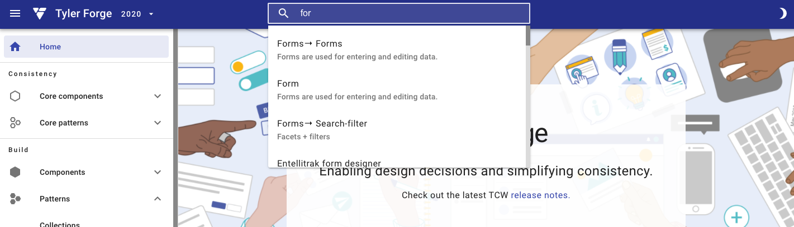

</ImageBlock>

<ImageBlock max-width="750px" caption="A <b>local search</b> allows users to search a page or section.">

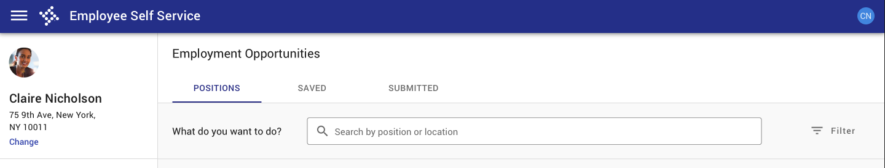

</ImageBlock>

<ImageBlock max-width="750px" caption="A <b>category search</b> allows users to search within specific categories, but requires additional decisions around which category to pick.">

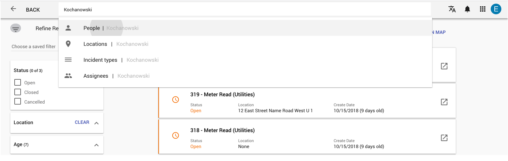

</ImageBlock>

<ImageBlock max-width="750px" caption="An <b>advanced or multi field search</b> communicates what can be searched but results in more decisions around which field to use.">

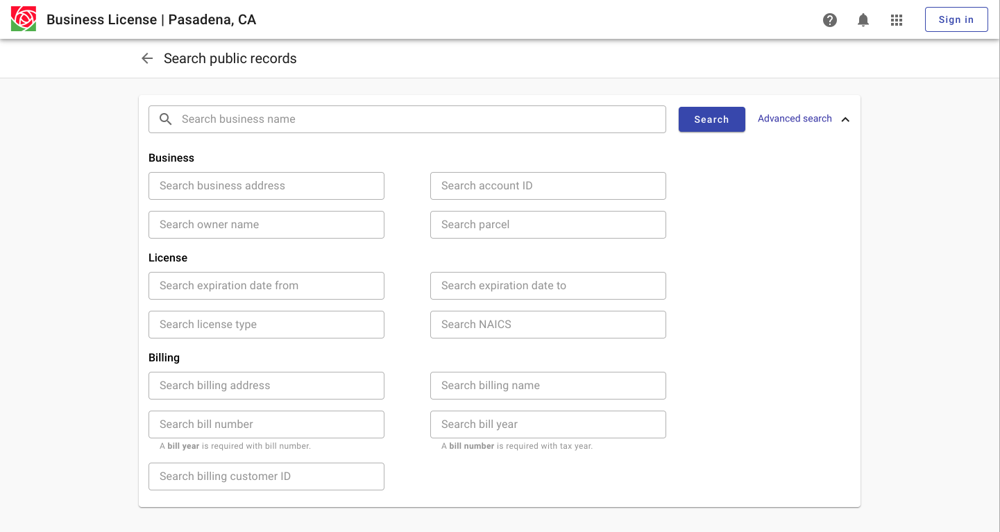

</ImageBlock>

See advanced search in action in the [Resident Access case study](/core/other/case-studies/resident-access)!

---

## 2. Show results 

**Design principle**

Use structure (result ordering, information design, and visual hierarchy) to help users match results with mental model. 

**Components to use**

| Component                  | Intent                                                                           | Tradeoff
| -------------------------- | -------------------------------------------------------------------------------- | -------------------
| Task cards                 | Better for displaying a few label value pairs per record. Better for expansions. | Can view fewer total results on a page, not optimized for mobile.
| [Cards](/components/cards/card)  | Better for visual or nonhomogenous data.                                         | Not optimized for large blocks of text.
| [List](/components/lists/list)   | Better for scanning, can view more results on a page.                            | Not optimized for image heavy data.

:::note
See also [Collections](/patterns/collections) guidance.
:::

<ImageBlock max-width="750px" caption="Displaying results as task cards can facilitate displaying summary information.">

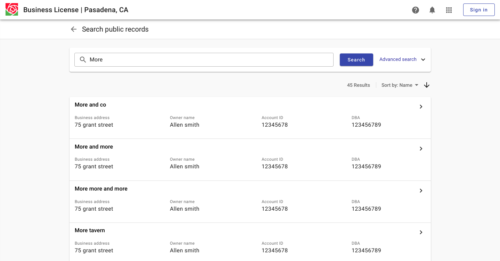

</ImageBlock>

<ImageBlock max-width="750px" caption="Displaying results as cards is better for visual data.">

</ImageBlock>

<ImageBlock max-width="750px" caption="Displaying results as a list facilitates scanning.">

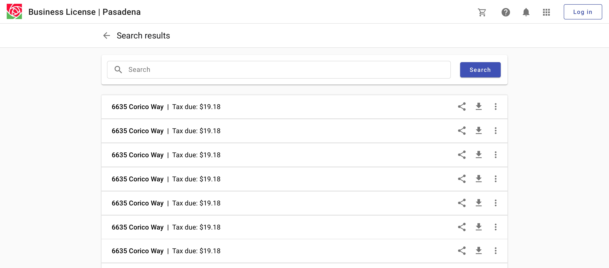

</ImageBlock>

---

## 3. Refine results 

**Design principles**

- Help users iteratively refine selections by providing logical filter categories.
- Indicate which filters have been applied, especially if the filter sheet has been closed. 

**Components to use**

See [Filter sidesheet](/components/filter-sidesheet)

| Component            | Intent                                                                                                | Tradeoff
| -------------------- | ----------------------------------------------------------------------------------------------------- | ---------------
| Sidesheet with scrim | Better when screen real estate is limited. Filters should be applied with an explicit "Apply" option. | Loss of context / detail for records.
| Persistent sidesheet | Allows users to reference filters and search results at the same time.                                | Not optimized for smaller screen sizes.

<ImageBlock max-width="600px" caption="A persistent filter side sheet allows users to reference filters and search results at the same time and is better optimized for desktop. With a lefthand navigation, filters are shown to the right. With no navigation, filters are displayed on the left by default.">

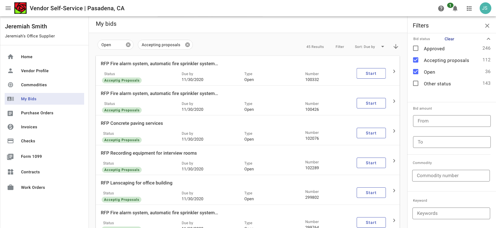

</ImageBlock>

<ImageBlock padded={false} caption="A sidesheet with scrim is better for mobile contexts.">

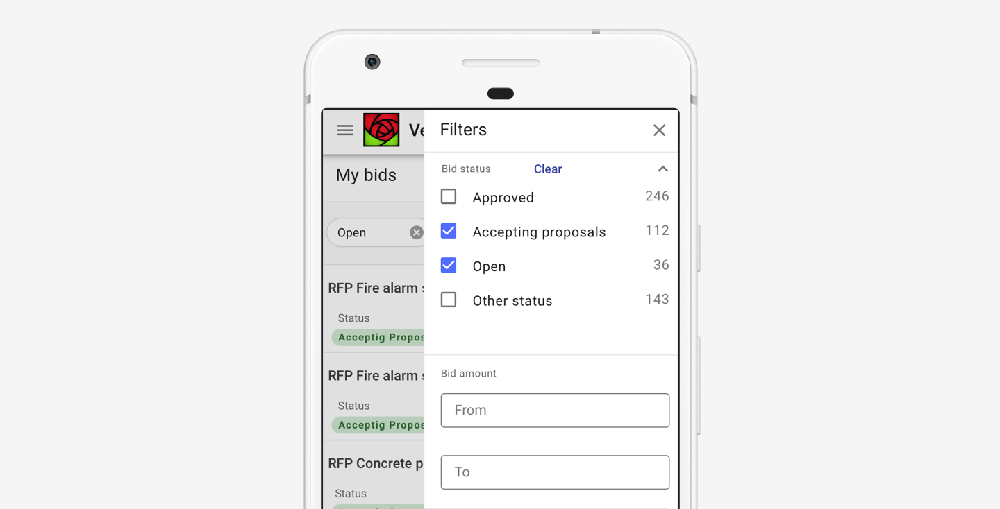

</ImageBlock>

## 4. View detail 

**Design principles**

- Progressive disclosure. 
- Match content amount to mode (expansions and dialogs for less detail; full page for more detail).

**Components to use**

| Component                                            | Intent                                                      | Tradeoff
| ---------------------------------------------------- | ----------------------------------------------------------- | ---------
| [Expansion](/components/page/expansion-panel) / sidesheet | View detail in context - lower interaction cost.            | Not as much space for detail.
| [Dialog](/components/notifications-and-messages/dialog)                         | Focused experience, may facilitate editing.                 | Loss of context.
| Detail page                                          | Focused experience, better for displaying more information. | Loss of context.

<ImageBlock max-width="600px" caption="Search results with expansions allow for displaying content in context.">

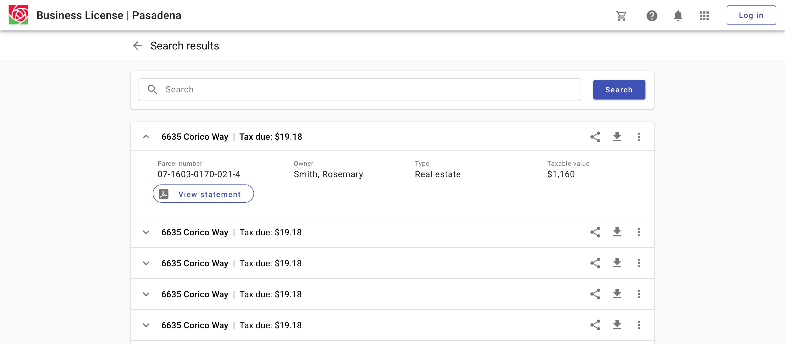

</ImageBlock>

<ImageBlock max-width="600px" caption="Displaying detail in a dialog allows for a focused experience and may facilitate editing.">

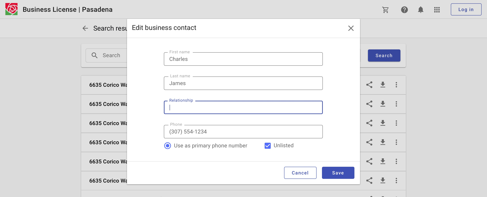

</ImageBlock>

<ImageBlock padded={false} caption="Displaying detail in a separate page better facilitates more information. Use a back arrow to allow users to navigate back to a search.">

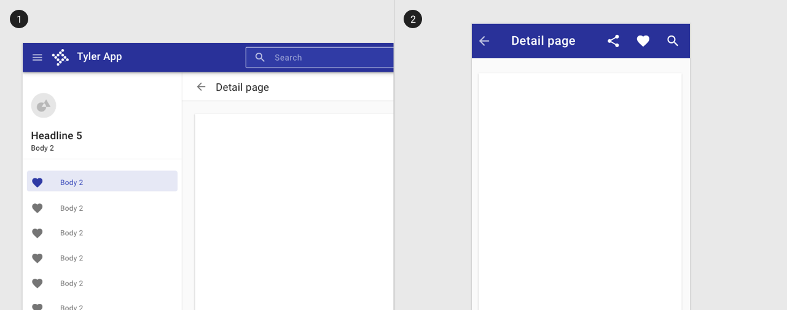

</ImageBlock>

## 5. Return to results 

**Design principle**

Return users to their prior screen position and state, such as their vertical scroll position, to facilitate recall and task resuming. 

**Components to use**

[Toolbar](/components/page/toolbar) with back arrow.

<ImageBlock padded={false} caption="Displaying detail in a separate page better facilitates more information. Use a back arrow to allow users to navigate back to a search.">

</ImageBlock>

---

## Related

Search is  composed of the following components:

- [Filter sidesheet](/components/filter-sidesheet), [drawer](/components/navigation/drawer), [toolbar](/components/page/toolbar), [card](/components/cards/card), [list](/components/lists/list), [radio button](/components/controls/radio-button), [switch](/components/controls/switch), [checkbox](/components/controls/checkbox)

Forms are related to the following patterns:

- [Collections](/patterns/collections)
