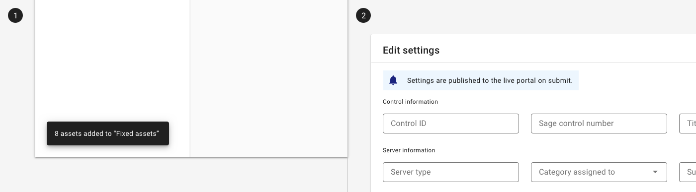
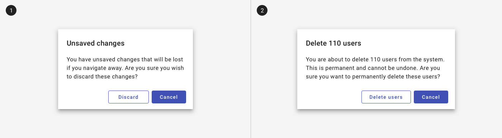
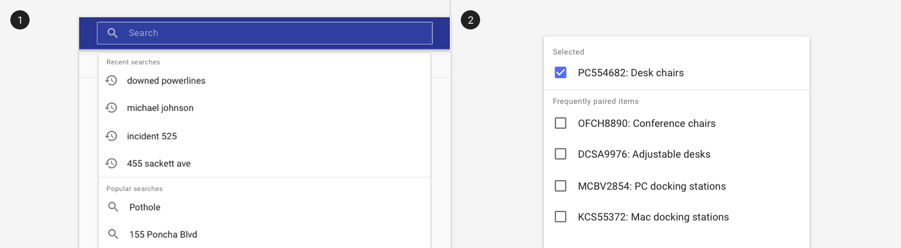

# System communication

Effective system communication facilitates trust in the system by communicating relevant information in the appropriate context.  

System communication aligns with the following user goals:

1. Inform me 
2. Ask me 
3. Suggest to me

---

## 1. User goal: Inform me

Inform users of system information such as updates, errors, or offline functionality; or acknowledge actions that have been performed, such as a new record added, updated, or removed. 

### Design principles

- **Minimize interruptions.** Only surface information that's critical to use of the app.
- **Match likelihood with criticality.** Use less interruptive methods for less critical information.

### Components to use

| Component                                        | Intent                                                                                                                  | Tradeoffs
| :------------------------------------------------| :---------------------------------------------------------------------------------------------------------------------- | :---
| [Toast](/components/notifications-and-messages/toast)                       | Use to inform users of a process that the app has performed or will perform. Non-interruptive.                          | Transient and may be missed; better for non critical information. 
| [Inline message](/components/inline-message)     | Use to display contextual information, such as an error summary or helpful tip, inside an element like a form or card.  | Take up more screen real estate and persistent / non-dismissible. 
| [Page banner](/components/banner)                | Use to display one-time, dismissible page level information, such as new features or client announcements.              | Transient and must be dismissed.  

<ImageBlock padded={false} caption="1. A toast provides a notification that records have been updated.   2. An inline message provides additional information on a form.">

</ImageBlock>

---

## 2. User goal: Ask me

Ask users before taking potentially destructive actions, such as navigating away from a page with unsaved changes, deleting a record, or overwriting an existing record. 

### Design principles

- **Provide clear options.** "Discard options" and "Cancel" is more descriptive than "Ok" and "Cancel," for example.

### Components to use

[Dialogs](/components/notifications-and-messages/dialog) interrupt a user's work, but they can helpful in preventing data loss or when the system needs input from the user in order to continue.

<ImageBlock padded={false} caption="1. A dialog asks users to confirm before navigating away from unsaved changes.   2. A dialog prompts for confirmation before a destructive action.">

</ImageBlock>

---

## 3. User goal: Suggest to me

Suggest actions or selections based on a user's history; such as recent searches or suggested selections.

### Components to use

- Search (coming soon!)
- Suggest frequently paired options to users when appropriate on a multi [select](/components/fields/select).

### Design principles

- **Use existing behavior patterns to suggest logical options or next steps.**

<ImageBlock padded={false} caption="1. A search suggests recent options to a use.   2. A select suggests purchase orders that have been historically paired together.">

</ImageBlock>
