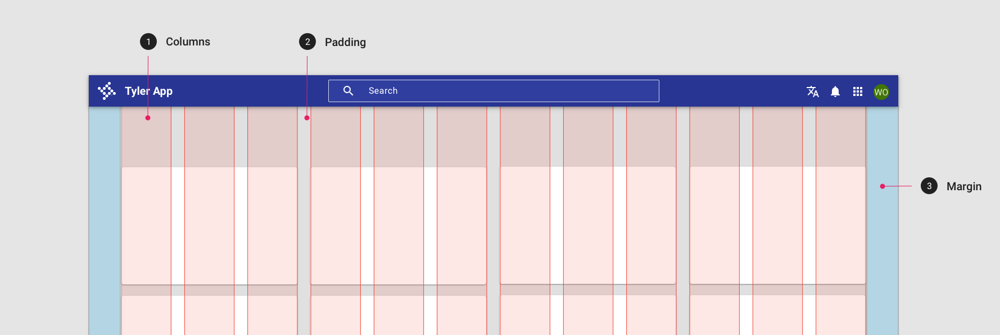
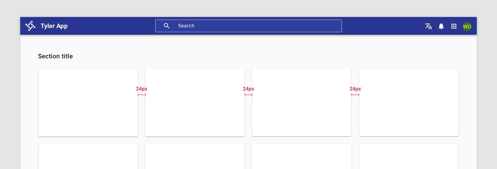
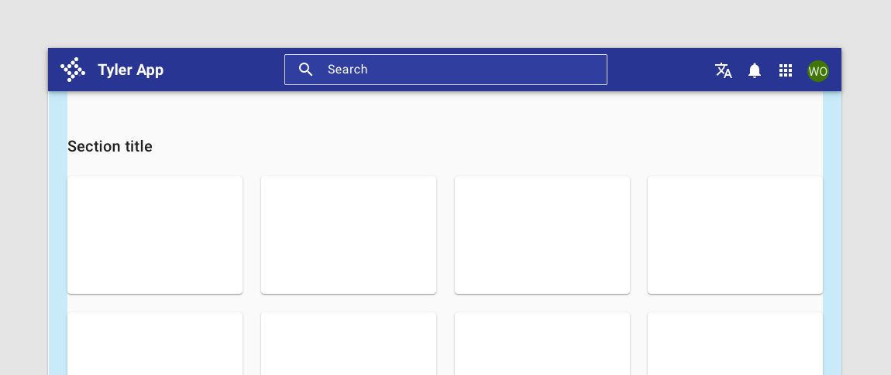

# Grid

Clear layouts allow users to understand and navigate content quickly and easily. Use these guidelines to create intuitive web layouts. 

## Overview

The Forge responsive layout grid adapts to screen size and orientation, ensuring consistency across layouts. Forge layouts are built on a 12 column grid, with columns, gutter, and margin. 

<ImageBlock padded="[false]">

</ImageBlock>

---

## Parts 

### Gutter

Gutters are the spaces between columns. They help separate content.

Use 16px or 24px between columns as standard gutters.

<ImageBlock padded="false">

</ImageBlock>

### Margin

Margins are the space between content and the left and right edges of the screen.

Margin widths are defined as fixed values at each breakpoint range. To better adapt to the screen, the margin width can change at different breakpoints. Wider margins are more appropriate for larger screens, as they create more whitespace around the perimeter of content.

<ImageBlock padded="false" caption="On a small tablet this layout grid uses 24px margins.">

</ImageBlock>

<ImageBlock padded="false" caption="On a small tablet this layout grid uses 16px margins.">

</ImageBlock>

---

## Responsive breakpoints 

Forge provides responsive layouts based on the following column structures. Layouts using 4-column, 8-column, and 12-column grids are available for use across different screens, devices, and orientations. Each breakpoint range determines the number of columns, and recommended margins and gutters, for each display size.

| Breakpoint range  | Window             | Columns           | Margins / gutters
| :-----------------| :----------------- | :---------------- | :----------------
| 360 - 599         | xsmall	           | 4                 | 16
| 600-719           | small              | 8                 | 16
| 720-839	          | small              | 8                 | 24
| 840-1023	        | small              | 12                | 24
| 1024 - 1439	      | medium             | 12                | 24
| 1440 - 1919	      | large              | 12                | 24
| 1920+	            | xlarge             | 12                | 24

---

## Content max-width

Max-widths are recommended for desktop apps to create focus on a page and facilitate cognitive fluency and readability ([Baymard Institute](https://baymard.com/blog/line-length-readability), “Typographie”, E. Ruder; [Song, Hyunjin, and Norbert Schwarz](https://dornsife.usc.edu/assets/sites/780/docs/08_ps_song___schwarz_effort.pdf); [How Cognitive Fluency Affects Decision Making](https://www.uxmatters.com/mt/archives/2011/07/how-cognitive-fluency-affects-decision-making.php), UX Matters). 

Your app's max width will depend on its content. 

| Content type      | Recommnded max-width     | Content examples   | App examples
| :-----------------| :----------------------- | :----------------  |: ---------
| Simple, single column      | 960px           | Detail views, data tables, steppers / process screens | [TESS Applicant info]( https://tylertech.invisionapp.com/share/BCWV4UDMARF#/411649317_Employment_Opportunities_-_Applicant_Info_-_Internal),  [CSS Add a new business stepper](https://tylertech.invisionapp.com/share/MWYOTXH2DA3#/431830941_Add_A_New_Business_Stepper_)
| Multi column         | 1040px                | Dashboards, complex detail pages                 | [VSS Search results ](https://tylertech.invisionapp.com/share/45YM7YLJUQT#/412708821_PO_SearchResults),  [CSS Balance overview](https://tylertech.invisionapp.com/share/M4YL4IGXQST#/431561125_Motor_Vehicle_-_Balance_Overview_Not_Logged_In)
| Complex layouts         | 1280px             | Complex or back office dashboard screens, data heavytables                  | [TESS Time off requests](https://tylertech.invisionapp.com/share/SPS26KRZJUA#/404641352_My_Team_-_Time_Off_Requests)

:::info But isn’t white space wasted space?

No. White space can be a great tool to balance design elements, create room to breathe, lower the perceived density of content, feature elements on the page to stand out, and guide the eye to create focus. Overall, designs with more white space are quicker to mentally process and understand, perceived as “less busy,” and are generally more aesthetically pleasing ([The power of white space](https://www.interaction-design.org/literature/article/the-power-of-white-space), IDF).

:::

---

## The 4px grid

Forge components are built on an 4px grid. Our minimum unit of 4 x 4 pixels drives how column layouts are determined, how elements are designed, and how components interact with each other. 

Grid systems are used to create layouts with a uniform and consistent structure. The goal is to yield predictable flexibility with the least amount of assets and rules. 

<ImageBlock padded="false">

</ImageBlock>
