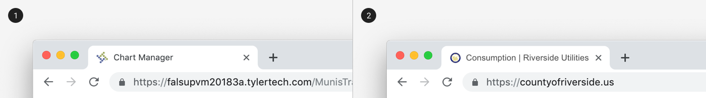
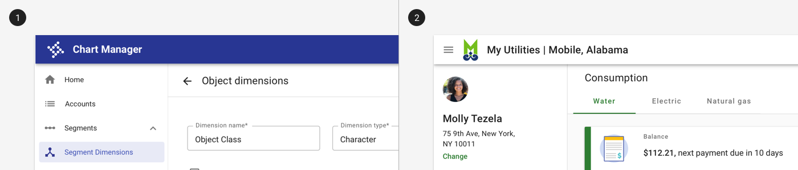
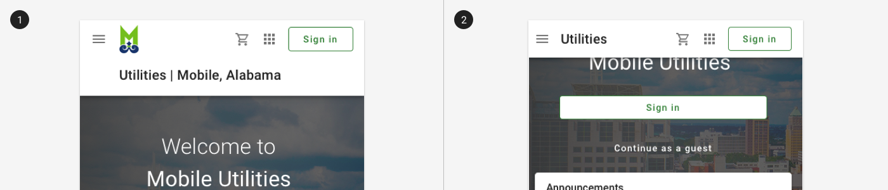
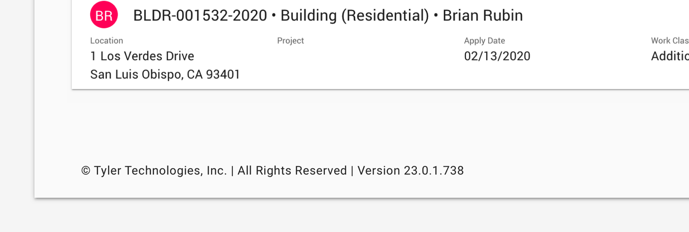
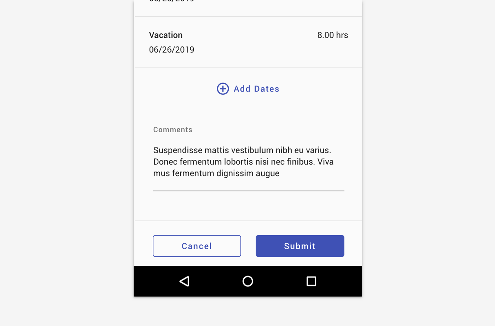

# Branding: Backoffice

Our brand is what we stand for, a promise we make, and the personality we convey as a business. It represents the entire experience someone has with our company. 

## Parts

Branding appears in four parts of a Tyler app: 1. Browser favicon and page title, 2. Omnibar, 3. Footer, 4. Imagery. 

## 1. Browser favicon and page title

Backoffice apps use the Tyler logo as the favicon, which displays in the browser tab. (See the "CDN Resources" section at the bottom of this page.)

Backoffice apps use the following format to display page titles in the browser tab:

```   
{Tyler logo} <Page name> | <App name>
```

<ImageBlock padded={false} caption="1. Backoffice apps use the Tyler logo and page name (if applicable) and application name. <br>2. Citizen apps use the municipality logo, page name (if applicable), municipality name, and app name.">



</ImageBlock>

## 2. Omnibar branding

Backoffice apps use the Tyler logo in the omnibar. (See the CDN resources at the bottom of this page.)

<ImageBlock padded={false} caption="1. Use the Tyler logo in the omnibar for backoffice apps. <br>2. Citizen apps use municipality branding and are white by default." style={{marginBottom: '32px'}}>



</ImageBlock>

<ImageBlock padded={false} caption="1. Citizen apps may use an extended omnibar to dispaly municipality name and app name on page load. <br>2. On scroll, the omnibar shrinks to its default height.">



</ImageBlock>

## 3. Footer (Optional)

Backoffice Tyler branded apps may use the following footer text in the lower left corner of the screen, painted on the background canvas. It is not persistently in view, instead it moves as the page scrolls. The version number is optional.

```
© Tyler Technologies, Inc. | All Rights Reserved | Version 1.0.0.0
```

The footer may be omitted for screens that have persistent controls at the bottom of the viewport. 

<ImageBlock padded={false} caption="A footer may be displayed at the bottom of the page. ">



</ImageBlock>

<ImageBlock padded={false} caption="A footer should be omitted on pages with persistent controls.">



</ImageBlock>

## 4. Imagery 

If your app needs photo imagery (ie, for default banner or background images), use our Tyler Getty account. For access, reach out to <a href="mailto:larry.permenter@tylertech.com">Larry Permenter</a>. Instructions can be found here. Additional branding imagery can be accessed from Tyler DAM. For spot or banner illustrations, check out our Illustration Library.

---

<DoDontGrid>
  <DoDontRow>
  <DoDontImage>


  </DoDontImage>
  <DoDontImage>


  </DoDontImage>
  </DoDontRow>
  <DoDontRow>
    <DoDont type="do">Use clear imagery for the Tyler logo. </DoDont>
    <DoDont type="dont">Don’t use screenshots or low quality images for the Tyler mark. </DoDont>
  </DoDontRow>
</DoDontGrid>

--- 

## CDN resources

Use the following CDN links for Tyler branding assets. 

Omnibar logo:

```
https://cdn.forge.tylertech.com/v1/images/branding/tyler/talking-t-logo.svg
```

Favicon:

```
https://cdn.forge.tylertech.com/v1/images/branding/tyler/talking-t-logo.svg
```

---

## Related

### Components 

- Branding is implemented as part of the [omnibar](/components/omni/omnibar)
- [Illustrations](/core/styles/illustrations) are an expression of the Tyler brand
- Branding assets can be found as part of the [CDN](/assets/cdn)
