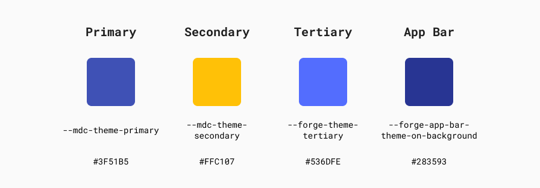
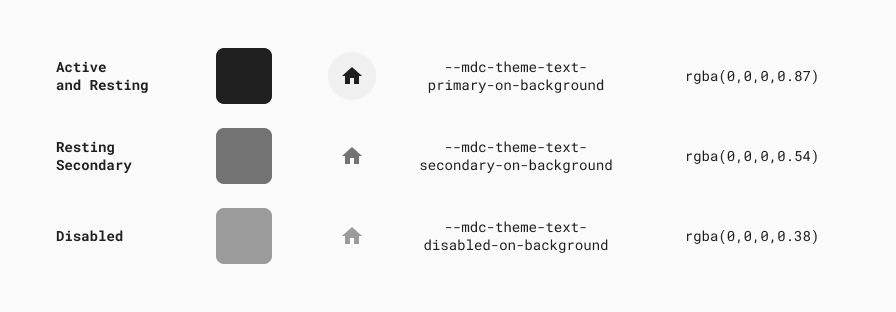
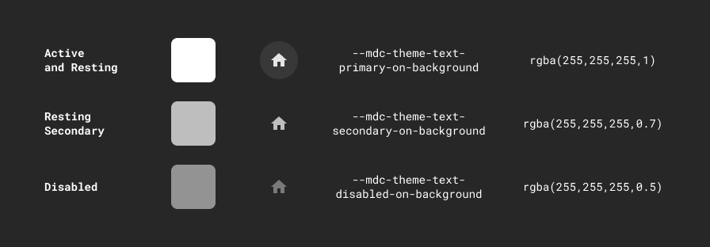
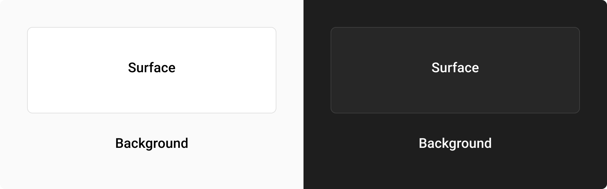
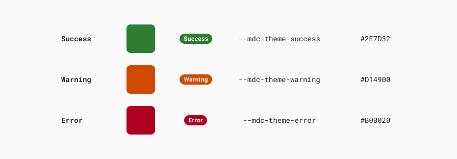

# Color

The Forge color system serves as a meaningful expression of our brand.

## Overview 

Color serves as an expression of the Tyler brand and a strong visual indicator of consistency across our products. Our colors are based in the [Material Design color system](https://material.io/design/color/the-color-system.html).

Tyler is committed to meeting AA WCAG contrast ratios. To this end, we've chosen a primary, secondary, and tertiary colors that support usability across a variety of experiences. Our primary and secondary color support our Tyler brand and our tertiary color is chosen specifically for controls in order to ensure sufficient contrast so that users with low vision can use our products well. 

---

## Parts 

The Tyler Forge color system is comprised of five parts: 1. Main palette, 2. Icon colors, 3. Surface colors, 4.Informational colors 5. Additional palettes. 

### 1. Main palette 

The main palette is used to establish Tyler’s theme and primary look & feel. It’s derived from Material’s color system. Tyler uses Indigo 500 as its primary color [feel associations] and amber 500 for its secondary color, used for visual accents [feel association]. The omnibar takes a darker hue of the primary indigo. Controls use our tertiary color of Indigo A200 to provide sufficient contrast for controls. 
In general, the Forge components are already themed correctly to provide the appropriate colors needed. 

### 2. Icon colors 

Icon colors are meant to provide consistent visual cues around interactivity. The Tyler Forge system provides colors for “active + focused” (user is currently interacting with the icon), “resting” (icon is interactive but isn’t currently being used), and “disabled” (icon isn’t interactive). 

On light

On dark

### 3. Surface colors

Surface colors are intended to provide contrast against the content that sits on them. Tyler Forge uses a light grey on app backgrounds to provide contrast to white surfaces that contain content. Surfaces containing text are generally white to create sufficient contrast against black text. 

### 4. Informational colors

Informational colors communicate additional information and should be used somewhat sparingly. **To be ADA compliant, statuses such as “success,” “warning,” and “error” should not be communicated by color only.** Use text in addition to color, or an icon in addition to color to communicate these states. 

“Success” and “warn” may be used part of workflow states or in badges to communicate statuses. “Danger” is used by default in the error state on inputs.

## 5. Additional palettes

Colors may be used in additional parts of Tyler apps. Specifically, [badges](/components/notifications-and-messages/badge), [inline messages](/components/notifications-and-messages/inline-message), and [page banners](/components/notifications-and-messages/banner) have their own palettes to communicate specific statues. Additionally, data visualization uses its own palettes to ensure ADA compliance. 

---

## Themes 

Tyler Forge currently supports two additional themes:
-  Dark theme: used for aesthetic preferences
-  Surveillance theme: used for covert operations, especially in law enforcement apps

More themes may be supported in the future.

---

## Related 

### Components 

The following components have their own color palettes:

- [Badges](/components/notifications-and-messages/badge)
- [Inline messages](/components/notifications-and-messages/inline-message)
- [Banners](/components/notifications-and-messages/banner)

### Patterns

Coming soon...
