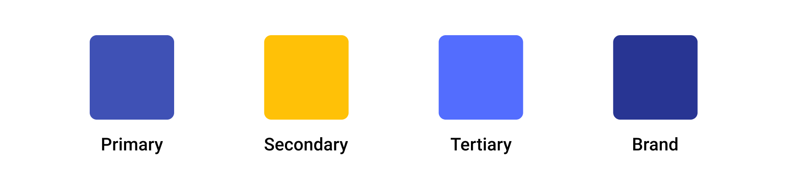
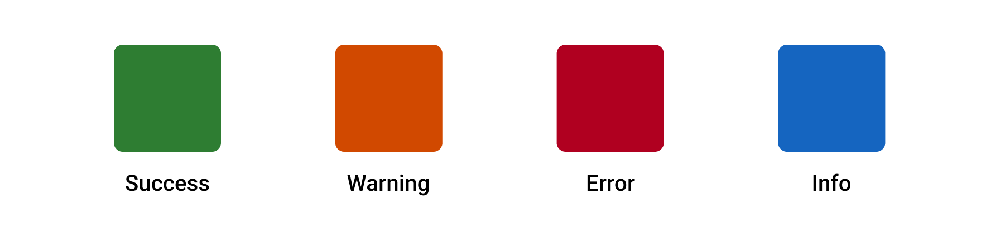

# Color

The Forge color system serves as a meaningful expression of our brand.

## Overview 

Color serves as a strong visual indicator of consistency across products that use Tyler Forge.

Tyler is committed to meeting AA WCAG contrast ratios. To this end, we've chosen a primary, secondary, and tertiary colors that support usability across a variety of experiences. Our primary and secondary color support our Tyler brand and our tertiary color is chosen specifically for controls in order to ensure sufficient contrast so that users with low vision can use our products well.

---

## Parts 

The Tyler Forge color system is comprised of three parts: 1. Main palette, 2. Surface colors, 3. Informational colors.

### 1. Main palette 

The main palette is used to establish Tyler’s theme and primary look & feel. The Forge components at their core use these primary, secondary, and tertiary colors, along with a brand color. In general, the Forge components are already themed correctly to provide the appropriate colors needed.   

### 2. Surface colors

Surface colors are intended to provide contrast against the content that sits on them. Tyler Forge uses a light grey on app backgrounds to provide contrast to white surfaces that contain content. Surfaces containing text are generally white to create sufficient contrast against black text.   

### 3. Informational colors

Informational colors communicate additional information and should be used somewhat sparingly. The most common use cases for these informational colors are with certain components, such as the banner, badges, and inline messages, though they can be used elsewhere when needed.

There are 4 informational colors:

Success, Error, Warning, and Info.

All four are semantic colors and generally used as indicators for various workflow states or in badges to communicate statuses. Error is also used by default in the error state on inputs.

:::info
To be ADA compliant, statuses such as “success,” “warning,” and “error” should not be communicated by color only. Use text in addition to color, or an icon in addition to color to communicate these states.
:::

---

## Additional palettes

Sometimes more colors are needed in various designs. These additional colors are used when necessary and specifically with certain components: badges, inline messages, and page banners. While these components have their own palettes to communicate specific statuses, sometimes more colors are needed for various reasons.

Colors may be used in additional parts of Tyler apps. Specifically, [badges](/components/notifications-and-messages/badge), [inline messages](/components/notifications-and-messages/inline-message), and [page banners](/components/notifications-and-messages/banner) have their own palettes to communicate specific statues. Additionally, data visualization uses its own palettes to ensure ADA compliance. 

---

## Themes 

Forge components support theming through the use of its token structure. Currently only light and dark themes are built in to the components. This allows users to easily switch between dark and light versions of their applications depending on what they enjoy using more. With the structure of the Forge components, it's easily possible to add you own custom branding themes for your use cases. 
