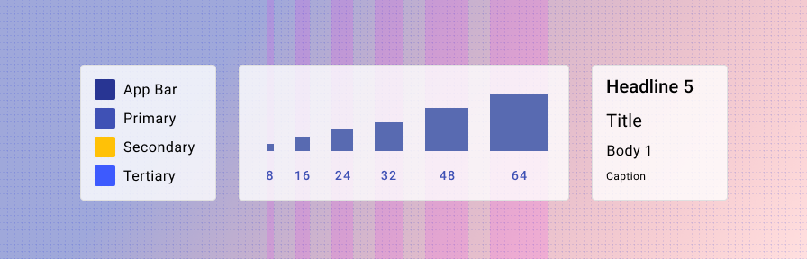

# Overview

<ComponentVisual>

</ComponentVisual>

Styles are the fundamental design properties that set the "look and feel" of a Forge application. 

They are incorporated into the components in the [Forge Components library](https://forge.tylerdev.io/).

Components built to exist in an application alongside Forge Components should use these Styles.