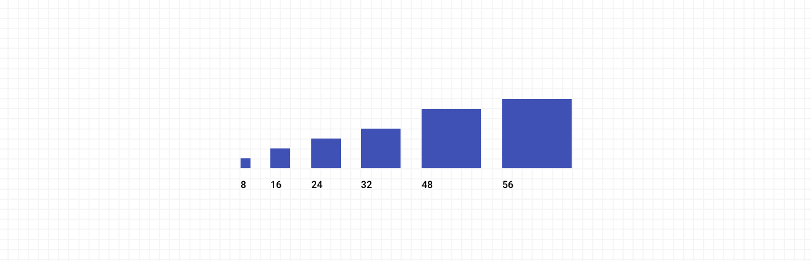

# Spacing

<ImageBlock padded={false}>

</ImageBlock>

## Overview

Clear, consistent spacing allows users to understand and navigate content quickly and easily. Use these guidelines to create intuitive, well-organized layouts that enhance usability and visual hierarchy.   

Forge uses a 4px-based spacing system for layout structure, ensuring all content and components align to a balanced grid. This systematic approach creates visual consistency and makes layouts feel organized and predictable.   

The spacing system provides predetermined values that work harmoniously together, eliminating guesswork in layout decisions while maintaining flexibility for different design needs.   

---

## Spacing scale and usage

The Forge spacing system includes the following values with guidance for both padding (inside elements) and margin (between elements):

| Spacing | Padding Usage                        | Margin Usage                             | Examples                              |
| ------- | ------------------------------------ | ---------------------------------------- | ------------------------------------- |
| 2px     | Minimal internal spacing             | Very tight element separation            | Border spacing, fine adjustments      |
| 4px     | Compact component padding            | Minimal gaps between elements            | Small buttons, tight layouts          |
| 8px     | Small component padding              | Default spacing between Chips            | Compact buttons, form elements        |
| 12px    | Medium-small padding                 | Close related elements                   | Input field padding, small cards      |
| 16px    | Default padding for most components  | Dense spacing for related content        | Cards, dialogs, form field groups     |
| 20px    | Comfortable component padding        | Moderate element separation              | Medium containers, content spacing    |
| 24px    | Roomy padding for containers         | Default spacing between related elements | Spacious cards, content sections      |
| 32px    | Generous padding for larger elements | Clear separation between sections        | Content blocks, page sections         |
| 48px    | Spacions padding for prominent areas | Generous separation for major divisions  | Hero sections, main content areas     |
| 56px    | Maximum padding for key components   | Maximum separation and component heights | App Bar height, major layout sections |

### Layout guidelines

**Consistency**

- Use the same spacing values throughout your application for similar relationships.
- Maintain spacing patterns across different pages and sections.
- Apply spacing systematically rather than making arbitrary adjustments.

**Hierarchy**

- Smaller spacing indicates closer relationships between elements.
- Larger spacing creates clear separation and visual breaks.
- Progressive spacing helps establish content hierarchy and flow.

**Responsive considerations**

- Maintain proportional spacing across different screen sizes.
- Consider reducing spacing on smaller screens when necessary.
- Preserve visual relationships even when adjusting spacing values.

### Common spacing patterns

**Content sections**

- Between paragraphs: 16px
- Between content blocks: 24px
- Between major sections: 32px or 48px

**Form elements**

- Between form fields: 16px or 24px
- Between form sections: 32px
- Form field padding: 16px

**Navigation elements**

- Between menu items: 8px or 16px
- Around navigation groups: 24px or 32px
- Navigation container padding: 16px or 24px
