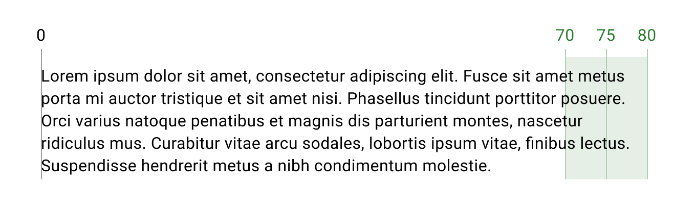
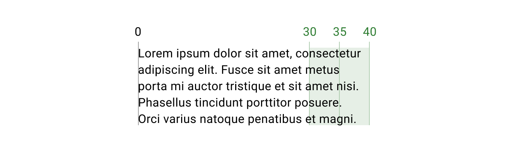

# Typography

## Overview

Tyler Forge provides a purposeful set of typographic styles. Consistently tying typographic styles to appropriate sections and functions in an interface creates clear visual patterns and expectations.

Tyler Forge uses Roboto as its primary typeface and it is used throughout the entire component library.

Aa Bb Cc Dd Ee Ff Gg Hh Ii Jj Kk Ll Mm Nn Oo Pp   
Qq Rr Ss Tt Uu Vv Ww Xx Yy Zz   
0123456789 !@#$%^&*()[]{}

### Accessibility

To ensure proper screen reader navigation, use the native HTML semantic headers. Screen readers use an accessibility tree to read through a page, so they’ll follow the logical header order (H1 through H6) instead of the order seen visually on a page. Use headings to reflect page hierarchies, sections, and parent-child relationships, instead of for styling purposes. 

**Do not use semantic headings for stylistic purposes.** Instead, use semantic headings to create a logical hierarchy on the page, and use the Forge typography classes to style your text. The code snippets below include semantic headings as examples only; they’re not meant to be prescriptive. Be sure to use semantic headings that reflect your app’s logical hierarchy. 

---

### Styles

#### Display

<Columns type="equal" columns="two">

<LeftColumn>

Display styles are used for large, prominent text such as page titles and headings.

</LeftColumn>

<RightColumn>

Display 1

Display 2

Display 3

Display 4

Display 5

Display 6

Display 7

Display 8

</RightColumn>

</Columns>

#### Heading

<Columns type="equal" columns="two">

<LeftColumn>

Heading styles are used for page titles and section headings.

</LeftColumn>

<RightColumn>

Heading 1

Heading 2

Heading 3

Heading 4

Heading 5

Heading 6

Heading 7

Heading 8

</RightColumn>

</Columns>

#### Subheading
<Columns type="equal" columns="two">

<LeftColumn>

Subheading styles are used for section subheadings.

</LeftColumn>

<RightColumn>

Subeading 1

Subheading 2

Subheading 3

Subheading 4

Subheading 5

Subheading 6

Subheading 7

Subheading 8

</RightColumn>

</Columns>

#### Body
<Columns type="equal" columns="two">

<LeftColumn>

Body styles are used for paragraph text and general content text.

</LeftColumn>

<RightColumn>

Body 1

Body 2

Body 3

Body 4

</RightColumn>

</Columns>

#### Label
<Columns type="equal" columns="two">

<LeftColumn>

Label styles are used for small text such as form labels and captions.

</LeftColumn>

<RightColumn>

Label 1

Label 2

Label 3

</RightColumn>

</Columns>

#### Button
<Columns type="equal" columns="two">

<LeftColumn>

Button styles are used for button text.

</LeftColumn>

<RightColumn>

Button

</RightColumn>

</Columns>

### Overline
<Columns type="equal" columns="two">

<LeftColumn>

Overline styles are used for small, uppercase text such as section headers.

</LeftColumn>

<RightColumn>

Overline

</RightColumn>

</Columns>

---

## Best practices 

For desktop apps, setting a max to line length helps create a better reading experience for the user. If a line of text is too long, it can become difficult for the user to follow from the end of a line to the beginning of the next vertically. Use a max line-length of 75 characters to facilitate optimal reading patterns. You can center your content or use columns to constrain content width. On mobile, use a max line-length of 35 characters.

<Columns type="equal" columns="two">

<LeftColumn>

<ImageBlock padded={false} max-width="650px" caption="On desktop, aim to have your line length wrap at around 75 characters, including spaces.">

</ImageBlock>

</LeftColumn>

<RightColumn>

<ImageBlock padded={false} max-width="650px" caption="For mobile, aim to have your line length wrap at around 35 characters, including spaces.">

</ImageBlock>

</RightColumn>

</Columns>
