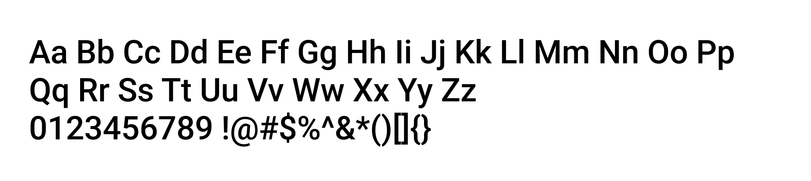
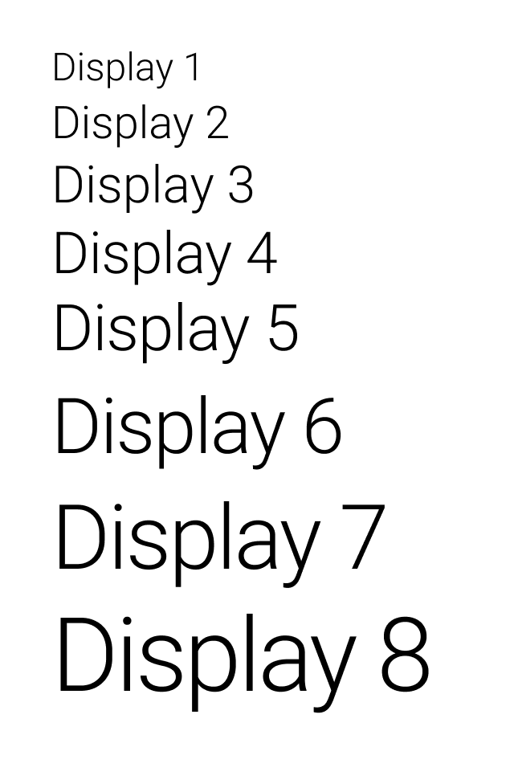
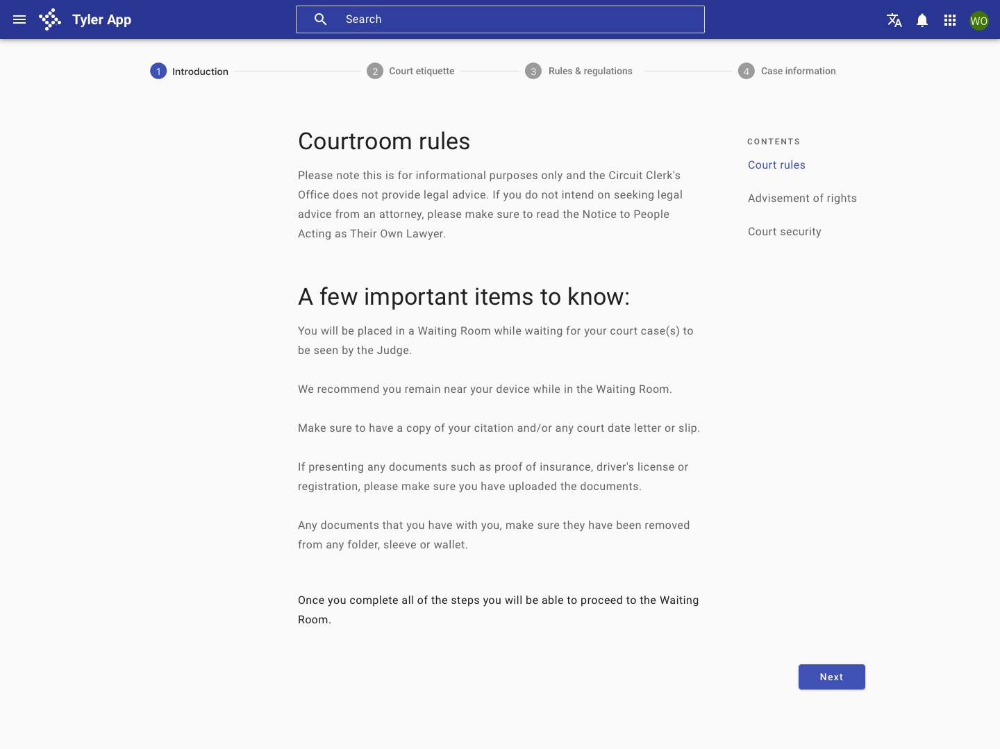
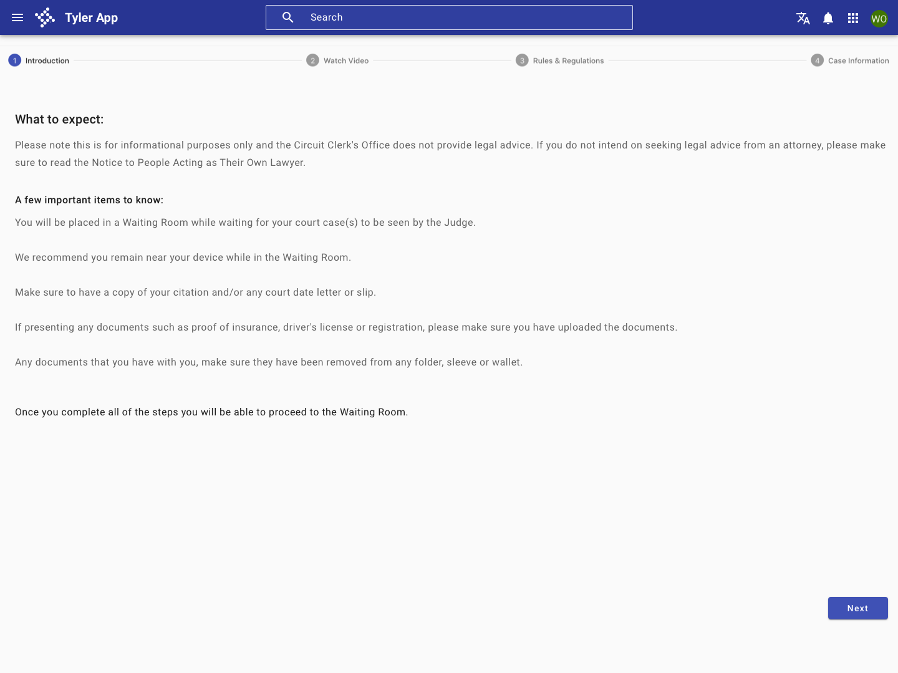
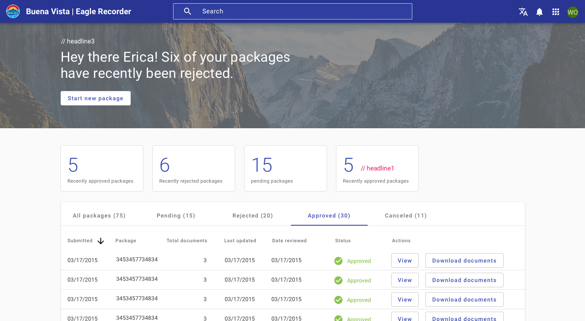
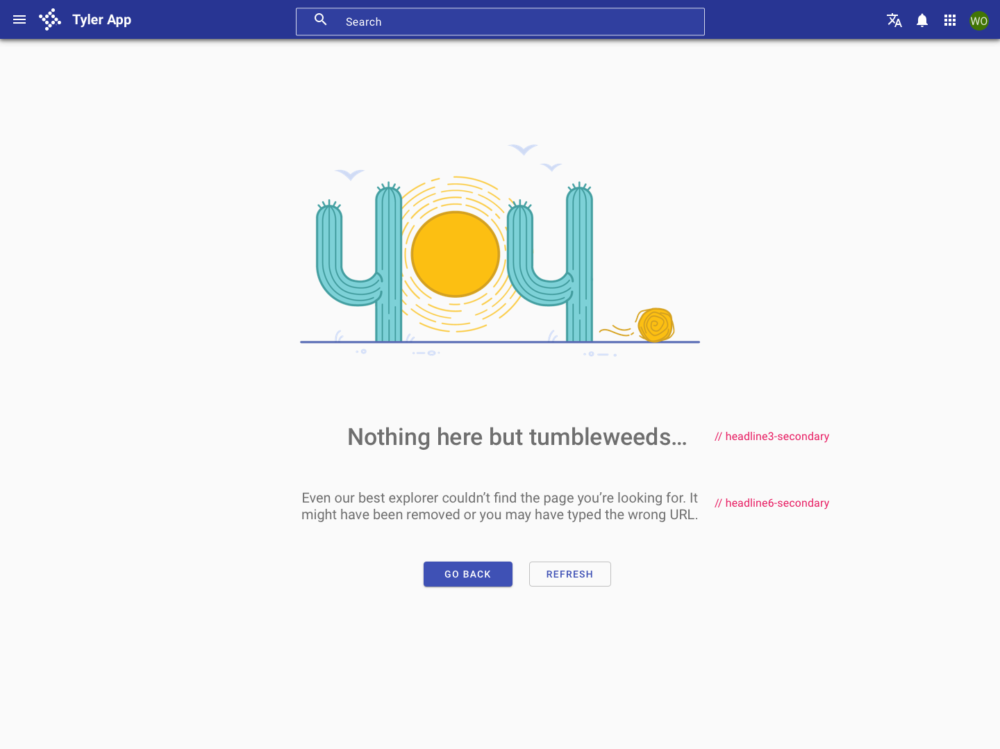
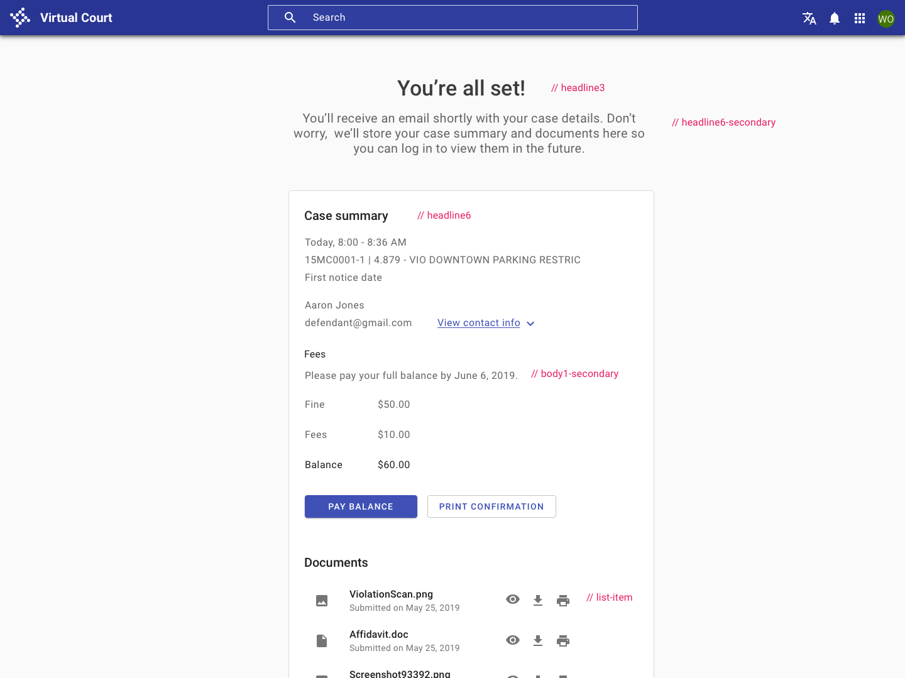
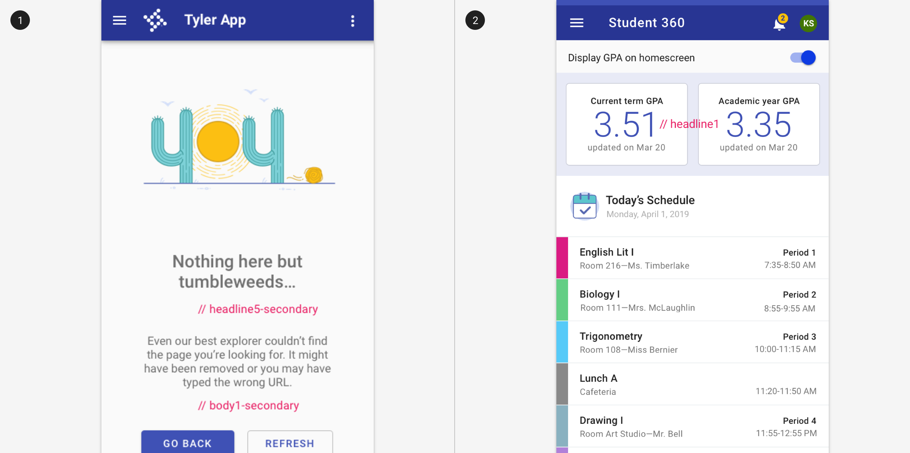

# Typography

## Overview

Tyler Forge provides a purposeful set of typographic styles. Consistently tying typographic styles to appropriate sections and functions in an interface creates clear visual patterns and expectations.

Tyler Forge uses Roboto as its primary typeface and it is used throughout the entire component library.

<ImageBlock padded={false} max-width="650px">

</ImageBlock>

### Accessibility

To ensure proper screen reader navigation, use the native HTML semantic headers. Screen readers use an accessibility tree to read through a page, so they’ll follow the logical header order (H1 through H6) instead of the order seen visually on a page. Use headings to reflect page hierarchies, sections, and parent-child relationships, instead of for styling purposes. 

**Do not use semantic headings for stylistic purposes.** Instead, use semantic headings to create a logical hierarchy on the page, and use the Forge typography classes to style your text. The code snippets below include semantic headings as examples only; they’re not meant to be prescriptive. Be sure to use semantic headings that reflect your app’s logical hierarchy. 

---

### Styles

#### Display
Display styles are used for large, prominent text such as page titles and headings.

<ImageBlock padded={false} max-width="100px">

</ImageBlock>

#### Heading
Heading styles are used for page titles and section headings.

#### Subheading
Subheading styles are used for section subheadings.

#### Body
Body styles are used for paragraph text and general content text.

#### Label
Label styles are used for small text such as form labels and captions.

#### Button
Button styles are used for button text.

### Overline
Overline styles are used for small, uppercase text such as section headers.

---

## Styles

Select from the following typography styles for your application. By default, type will inherit the body color Black at 87% opacity. For text that should have less visual emphasis, use Black at 54%.

## Header styles 

Use these for titles and subsection titles within your app. 

<Columns type="equal" columns="two">

<LeftColumn>

Display

Display styles are used for large, prominent text such as page titles and headings.

</LeftColumn>

<RightColumn>

<ImageBlock padded={false} max-width="100px">

</ImageBlock>

</RightColumn>

</Columns>

---

<Columns type="equal" columns="two">

<LeftColumn>

Headline 5

Used for the app name in the omnibar, primary page headers, card headers, and dialog headers.

</LeftColumn>

<RightColumn>

Size: 20px / 1.25rem

Line-height: 32px / 2rem

Weight: 500 / medium

Letter-spacing: 0.25px / .0125em

Color: rgba(0,0,0,.87)

</RightColumn>

</Columns>

---

<Columns type="equal" columns="two">

<LeftColumn>

Subtitle 1

Used for page subsections and sections within cards.

</LeftColumn>

<RightColumn>

Size: 16px / 1rem

Line-height:  28px / 1.75rem

Weight: 400 / medium

Letter-spacing: 0.15px / .009375em

Color: rgba(0,0,0, 0.54)

</RightColumn>

</Columns>

---

<Columns type="equal" columns="two">

<LeftColumn>

Subtitle 1, secondary

A visually heavier alternative to the default subtitle1 style.

</LeftColumn>

<RightColumn>

Size: 16px / 1rem

Line-height:  28px / 1.75rem

Weight: 500 / medium

Letter-spacing: 0.15px / .009375em

Color: rgba(0,0,0, 0.87)

</RightColumn>

</Columns>

---

<Columns type="equal" columns="two">

<LeftColumn>

Subtitle 2

Used for third-level page sections and subsections within cards.

</LeftColumn>

<RightColumn>

Size: 14px / .875rem

Line-height: 22px / 1.375rem

Weight: 500 / medium

Letter-spacing: .1px / .0071428571em

Color: rgba(0,0,0,0.54)

</RightColumn>

</Columns>

---

<Columns type="equal" columns="two">

<LeftColumn>

Subtitle 2, secondary

A visually lighter alternative to the default subtitle2.

</LeftColumn>

<RightColumn>

Size: 14px / .875rem

Line-height: 22px / 1.375rem

Weight: 400 / regular

Letter-spacing: .1px / .0071428571em

Color: rgba(0,0,0,0.54)

</RightColumn>

</Columns>

---

<Columns type="equal" columns="two">

<LeftColumn typeName="OVERLINE" typeClass="forge-typography--overline">

OVERLINE

Used as an alternate for sections within cards or navigation drawers. Use it for short titles or headers.

</LeftColumn>

<RightColumn>

Size: 12px / .75rem

Line-height: 32px / 2rem

Weight: 500 / medium

Letter-spacing: 2px / .167em

Color: rgba(0,0,0,0.87)

</RightColumn>

</Columns>

---

## Body text

<Columns type="equal" columns="two">

<LeftColumn>

Body 1

Used for primary body text.

Use black at 54% opacity for content that is less important or needs less emphasis.

</LeftColumn>

<RightColumn>

Size: 16px / 1rem

Line-height: 24px / 1.5rem

Weight: 400 / regular

Letter-spacing: 0.5px / .03125em

Color: rgba(0,0,0,0.87)

</RightColumn>

</Columns>

---

<Columns type="equal" columns="two">

<LeftColumn>

Body 2

Used for secondary text, primarily as part of multi-line lists or less important body text.

</LeftColumn>

<RightColumn>

Size: 14px / .875rem

Line-height: 20px / 1.25rem

Weight: 400 / regular

Letter-spacing: 0.25px / .0178571429em

Color: rgba(0,0,0,0.87)

</RightColumn>

</Columns>

---

## Additional styles

<Columns type="equal" columns="two">

<LeftColumn>

Caption

Used for secondary text, primarily as part of multi-line lists or less important body text.

</LeftColumn>

<RightColumn>

Size: 12px / .75rem

Line-height: 20px / 1.25rem

Weight: 400 / regular 

Letter-spacing: 0.533px / .0333333333em

Color: rgba(0,0,0,0.87)

</RightColumn>

</Columns>

---

## Display styles

<Columns type="equal" columns="two">

<LeftColumn>

Headline 1

</LeftColumn>

<RightColumn>

Size: 48px / 3rem 

Line-height: 48px / 3rem 

Weight: 300 / light

Letter-spacing: -1.5 / -.01563em 

Color: rgba(0,0,0,0.87)

</RightColumn>

</Columns>

---

<Columns type="equal" columns="two">

<LeftColumn>

Headline 2

</LeftColumn>

<RightColumn>

Size: 48px / 3rem

Line-height: 48px / 3rem

Weight: 400 / regular

Letter-spacing: normal

Color: rgba(0,0,0,0.87)

</RightColumn>

</Columns>

---

<Columns type="equal" columns="two">

<LeftColumn>

Headline 3

</LeftColumn>

<RightColumn>

Size: 34px / 2.125rem

Line-height: 34px / 2.125rem

Weight: 400 / regular

Letter-spacing: 0.25 / 0.015625em

Color: rgba(0,0,0,0.87)

</RightColumn>

</Columns>

---

<Columns type="equal" columns="two">

<LeftColumn>

Headline 4

</LeftColumn>

<RightColumn>

Size: 24px / 1.5rem

Line-height: 24px / 1.5rem

Weight: 400 / regular

Letter-spacing: normal

Color: rgba(0,0,0,0.87)

</RightColumn>

</Columns>

---

## Best practices 

<DoDontGrid>
  <DoDontRow>
  <DoDontImage>

  </DoDontImage>
  <DoDontImage>

  </DoDontImage>

  </DoDontRow>
  <DoDontRow>
    <DoDont type="do">For desktop apps, use a max line-length of 75 characters to facilitate optimal reading patterns. Center your content or use columns to constrain content width. On mobile, use a max line-length of 35 characters. </DoDont>
    <DoDont type="dont">Avoid text that wraps the full width of a desktop app, as it can become hard to read.</DoDont>
  </DoDontRow>
</DoDontGrid>

---

## Examples

<ImageBlock padded={false} max-width="650px">

</ImageBlock>

<ImageBlock padded={false} max-width="650px">

</ImageBlock>

<ImageBlock padded={false} max-width="650px">

</ImageBlock>

<ImageBlock padded={false} max-width="650px">

</ImageBlock>
