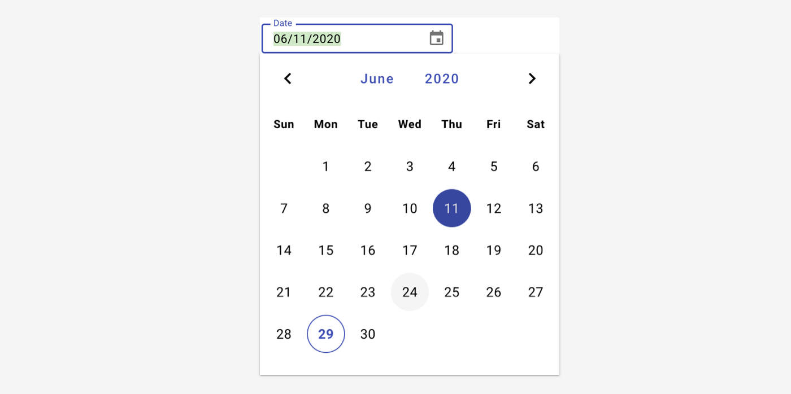
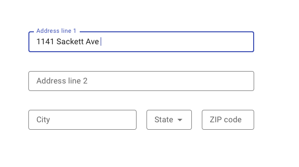
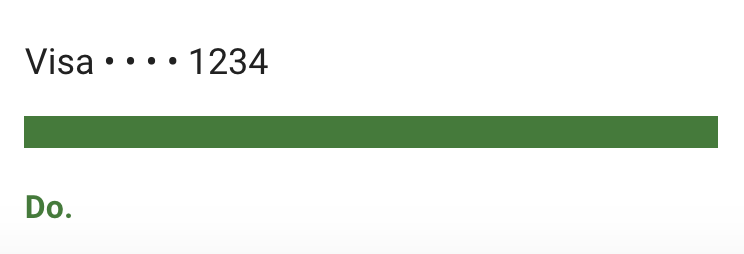

# Dates and times

This guide will help you craft consistent copy specific to the needs of your product teams that fit within the overarching voice and tone of Tyler Tech.

Data formats depict different types of numeric and linguistic data.

---

## Headers and titles

Use sentence casing for headers and titles (“Headers and titles” instead of “Headers and Titles”). Sentence case improves readability and gives proper nouns their proper emphasis. Want more proof? Here’s [a thorough, detailed, comprehensive, methodical guide to capitalizing strings in our user interface](https://medium.design/a-thorough-detailed-comprehensive-methodical-guide-to-capitalizing-strings-in-our-user-interface-11b39da146f3). For more information comparing sentence and title case, check out this [Guide to letter casing](https://uxplanet.org/why-letter-casing-is-important-to-consider-during-design-decisions-50402acd0a4e).

---

## Dates and times 

Forge recommends writing out dates whenever possible. Not only are written dates more clear, but they also translate better into other languages. For example, Feb 10, 2019 in Spanish is written as 10 de febrero (10/02/2019); portraying 02/10/2019 can be ambiguous depending on language of the user. 

Only use numeric formats for dates if there is a compelling reason (such as a lack of space in a table). 

| Type                                    | Non-numeric                                        | Numeric
| :---------------------------------------| :--------------------------------------------------| :----------------
| Time                                    | n/a                                                | 04:15 PM
| 24-hour time                            | n/a                                                | 14:00
| Time range                              | n/a                                                | 9:00 AM–3:00 PM; 10:00–11:30 AM
| Date, month, and year                   | Mar 3, 2019, December 15, 2019                     | 03/03/2019
| Day of week, date, month, and year      | Tue, Nov 7, 2019; Tuesday, January 6, 2019         | Tuesday, 11/07/2019; Tues, 01/06/2019
| With time (12 hour)                     | Mar 3, 2019 3:35 PM; March 3, 2019 3:35 PM         | 03/03/2019 3:35 PM
| With time (24 hour)                     | Mar 3, 2019 13:35 PM; March 3, 2019 13:35 PM       | 03/03/2019 13:35 PM
| Approximate time                        | In 5 minutes; 3 days ago                           | n/a
| Absolute time                           | Today, 10:00 AM                                    | n/a

---

## Date ranges

- Include only the minimum necessary information in order to keep date and time ranges short and clear.
- If the date range is in the same year (month), don’t repeat the year (month).
- Use a single AM or PM at the end of the range, if both times have the same AM/PM.
- To connect ranges use an en dash `&ndash;` with no spaces on either side.

| Type                  | Non-numeric                                             | Numeric
| :---------------------| :-------------------------------------------------------| :----------------
| Same month            | Apr 3–24, 2019                                          | 4/3–24/2019
| Same year             | Apr 3–Aug 17, 2019                                      | 04/23–8/17/2018
| Different years       | Apr 23, 2018–Jun 24, 2019                               |   04/23/2018–06/24/2019
| With time (12 hour)   | Jun 23, 2018 10:30 AM–Jun 24, 2019 01:15 PM             | 06/23/2018 10:30 AM–06/24/2018 01:15 PM
| With time (24 hour)   | Jun 23, 2018 10:30–Jun 24, 2019 13:15                   | 06/23/2018 10:30–06/24/2018 13:15
| With day of the week  | Tue, Jun 23, 2018 10:30 AM–Thu, Jun 24, 2018 01:15 PM   | Tue, 06/23/2018 10:30 AM–Thu, 06/24/2018 01:15 PM

---

## Abbreviations

Use the following abbreviations when writing out durations of time. Don’t use a period after the abbreviation.

**Time durations** Hrs, min, sec

**Time zones** EST (Eastern Time), CST (Central Time), MST (Mountain Time), PST (Pacific Time), AKST (Alaska Time),  HST (Hawaii Time)

**Days of the week**  Mon, Tue, Wed, Thu, Fri, Sat, Sun

**Month** Jan, Feb, Mar, Apr, May, Jun, Jul, Aug, Sep, Oct, Nov, Dec

---

## Date picker inputs

Use a numeric format for date picker inputs. Allow users to select a date from dropdown OR type in their own date. If possible, use masking to ensure a numeric date format. 

<ImageBlock padded={false}>

</ImageBlock>

---

<DoDontGrid>
  <DoDontTextSection>
    <DoDontText type="do">Whenever possible, display date and time information as people normally speak to each other, when space is available. This helps users understand what the date or time is for, such as: <b>“Store open 9:00 AM–Midnight”</b> or <b>“Reminder for tomorrow afternoon.”</b></DoDontText>
    <DoDontText type="do">Refer to <b>“yesterday”</b> or <b>“tomorrow”</b> in those terms.</DoDontText>
    <DoDontText type="do">If the day is in the upcoming week, include the day of the week (such as Tuesday).</DoDontText>
    <DoDontText type="do">For times that have occurred today, use Today, <b>10:00 AM</b> instead of <b>10/03/2019 AM.</b></DoDontText>
    <DoDontText type="do">For times that have occurred in the past week or will occur in the next week, round to the approximate day: <b>3 days ago, in 5 days.</b></DoDontText>
    <DoDontText type="do">For times that have occurred (will occur) more than a week ago (in the future), use the formal date: Jan 12, 2019, 01/12/2019. Omit the time, unless necessary.</DoDontText>
    <DoDontText type="do">Use a numeric format for date picker inputs: 10/03/2019.</DoDontText>
    <DoDontText type="do">Capitalize <b>AM</b> and <b>PM</b>.</DoDontText>
  </DoDontTextSection>
  <DoDontTextSection>
    <DoDontText type="dont">Don't combine numeric and non numeric data formats: <b>Wed January 09/19.</b></DoDontText>
    <DoDontText type="dont">Don't use atypical abbreviations: <b>Weds Jan 09.</b></DoDontText>
    <DoDontText type="dont">Don't use hyphens in dates: <b>1-5-19.</b></DoDontText>
    <DoDontText type="dont">Try to avoid long or busy date ranges: <b>Tue, 06/23/2018 10:30 AM–Thu, 06/24/2018 01:15 PM PST.</b></DoDontText>
  </DoDontTextSection>
</DoDontGrid>

---

## Contact info 

### Addresses

When a state name is used alone, without a city, spell out the name of the state.

Use **ZIP code** instead of the more informal Zip Code.

Use two-letter Postal Service abbreviations in tables, lists, mailing addresses, and displayed quote attributions.

 
 

Format **full addresses** as follows:

Mike Johnson
6230 Sackett Ave
Portland, ME 04102

 
 
If the town & city is implied, format **street addresses** as follows:

Mike Johnson
6230 Sackett Ave

<ImageBlock max-width="400px">

</ImageBlock>

### Phone numbers

Format US phone numbers as follows:

(207) 123-4567

### Email addresses

Format standard email addresses as follows:

firstname.lastname@tylertech.com

---

## Redaction 

Midline ellipses [• • •] are bulleted characters that partially hide sensitive data. They indicate when a number, such as a credit card or Social Security number, is not entirely visible.

### When to use 3 ellipses

To redact most numbers, like Social Security numbers, use three midline ellipses [• • •].You can use this format across typefaces and platforms:
1. Place two regular spaces before the first midline ellipse.
2. Then add a thin space between each midline ellipse and after the final one.

Or, use the Unicode string instead: U0020,U0020,U2022,U2006,U2022,U2006,U2022,U2006

<ImageBlock maxWidth="300px">

</ImageBlock>

#### When to use 4 ellipses 

Credit and debit card data must be redacted using four midline ellipses [• • • •].

Written in Unicode: U0020,U0020,U2022,U2006,U2022,U2006,U2022,U2006, U2022,U2006 

<ImageBlock maxWidth="300px">

</ImageBlock>
