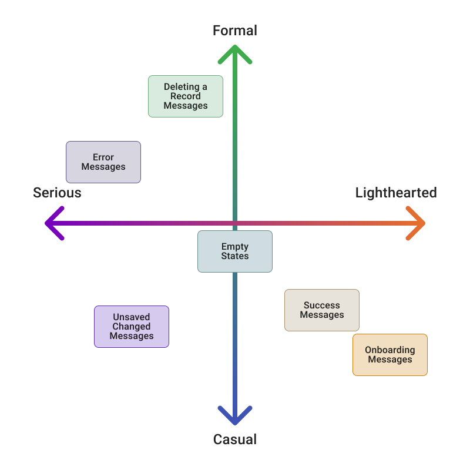

# Voice & Tone

Tyler’s ​**voice**​ represents our brand or personality as a company. It’s inspired from our organizational values:

* **Accountability:** We deliver what we promise. 
* **Focus:** We execute with intent.
* **Community:** We stand together.
* **Integrity:** We do the right thing.
* **Inclusion:** We respect and value each other.
* **Growth:** We invest in our future.

Tyler’s **voice** doesn’t change but our ​**tone** adapts to fit a product, situation, or specific persona. Our tone balances casual/formal and serious/lighthearted depending on the message.

## Tone Map

<ImageBlock usemap="#tonemap">

<map name="tonemap">
  <area shape="rect" coords="112,200,242,272" alt="Error Messages" href="/ux-content/common-messages/#error-messages"></area>
</map>

</ImageBlock>

## Examples

The examples below have the same voice, but two different tones to account for various audiences. Behind both of them suggest a warm, welcoming demeanor, but the words chosen fit slightly different contexts and personas.

* (To a close friend or colleague) “Hey! How’s it going?”
* (To a client) “Good morning. How are you today?”

Here’s another example:

* (Error Message - NOT Tyler’s voice and tone) “Shoot! This is going to take a while. You can do other things for now.”
* (Error Message - IS Tyler’s voice and tone) “Sorry! The process you requested will take longer than usual. You can work in other programs while it finishes.” 
