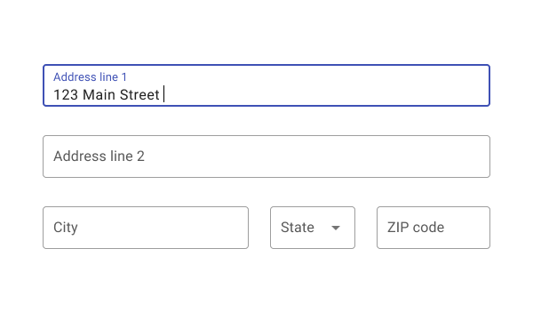
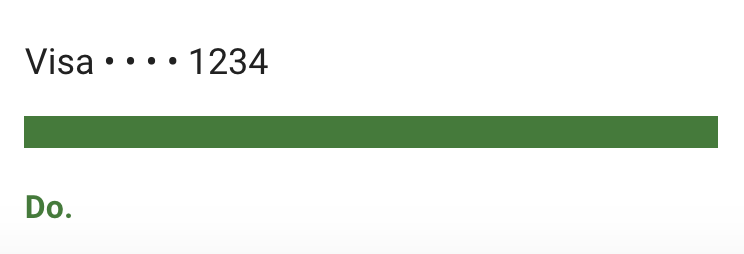

# Data formats

## Contact info 

### Addresses

When a state name is used alone, without a city, spell out the name of the state.

Use **ZIP code** instead of the more informal Zip Code.

Use two-letter Postal Service abbreviations in tables, lists, mailing addresses, and displayed quote attributions.

 

Format **full addresses** as follows:

Mike Johnson
6230 Sackett Ave
Portland, ME 04102

 

If the town and city is implied, format **street addresses** as follows:

Mike Johnson
6230 Sackett Ave

<ImageBlock max-width="400px">

</ImageBlock>

### Phone numbers

Format US phone numbers as follows:

(207) 123-4567

### Email addresses

Format standard email addresses as follows:

firstname.lastname@tylertech.com

---

## Lists: Bulleted and numbered

<Columns columns="two" type="equal" denseSpacing={true}>
  

    <DoDontGrid titleText="Do">
      <DoDontTextSection>
        <DoDontText type="do">List one</DoDontText>
        <DoDontText type="do">The first step is to start the process. </DoDontText>
      </DoDontTextSection>
    </DoDontGrid>
  

  

    <DoDontGrid titleText="Don't">
      <DoDontTextSection>
        <DoDontText type="dont">List one.</DoDontText>
        <DoDontText type="dont">The first step is to start the process</DoDontText>
      </DoDontTextSection>
    </DoDontGrid>
  

</Columns>

---

## Phone numbers

<Columns columns="two" type="equal" denseSpacing={true}>
  

    <DoDontGrid titleText="Do">
      <DoDontTextSection>
        <DoDontText type="do">(207) 123-4567</DoDontText>
      </DoDontTextSection>
    </DoDontGrid>
  

  

    <DoDontGrid titleText="Don't">
      <DoDontTextSection>
        <DoDontText type="dont">207.123.4567</DoDontText>
      </DoDontTextSection>
    </DoDontGrid>
  

</Columns>

---

## Redaction 

Midline ellipses [• • •] are bulleted characters that partially hide sensitive data. They indicate when a number, such as a credit card or Social Security number, is not entirely visible.

### When to use 3 ellipses

To redact most numbers, like Social Security numbers, use three midline ellipses [• • •].You can use this format across typefaces and platforms:
1. Place two regular spaces before the first midline ellipse.
2. Then add a thin space between each midline ellipse and after the final one.

Or, use the Unicode string instead: U0020,U0020,U2022,U2006,U2022,U2006,U2022,U2006

<ImageBlock maxWidth="300px">

</ImageBlock>

### When to use 4 ellipses 

Credit and debit card data must be redacted using four midline ellipses [• • • •].

Written in Unicode: U0020,U0020,U2022,U2006,U2022,U2006,U2022,U2006, U2022,U2006 

<ImageBlock maxWidth="300px">

</ImageBlock>

---

## URLs

If a URL can be located without the prefix, drop the prefix. 
When incorporating a link do not write about how to interact with a link.  Don't use "click on" or "click." Instead, try to link the URL as a natural phrase in the sentence, or link an entire short phrase. For example, “show all **open jobs** at Tyler Tech” Open jobs would be the clickable link. 

<Columns columns="two" type="equal" denseSpacing={true}>
  

    <DoDontGrid titleText="Do">
      <DoDontTextSection>
        <DoDontText type="do">Show <b>additional jobs</b> at Tyler Tech.</DoDontText>
        <DoDontText type="do"><b>Show jobs.</b></DoDontText>
      </DoDontTextSection>
    </DoDontGrid>
  

  

    <DoDontGrid titleText="Don't">
      <DoDontTextSection>
        <DoDontText type="dont">Click https://www.tylertech.com/careers/job-openings to view all open jobs at Tyler Tech.</DoDontText>
      </DoDontTextSection>
    </DoDontGrid>
  

</Columns>